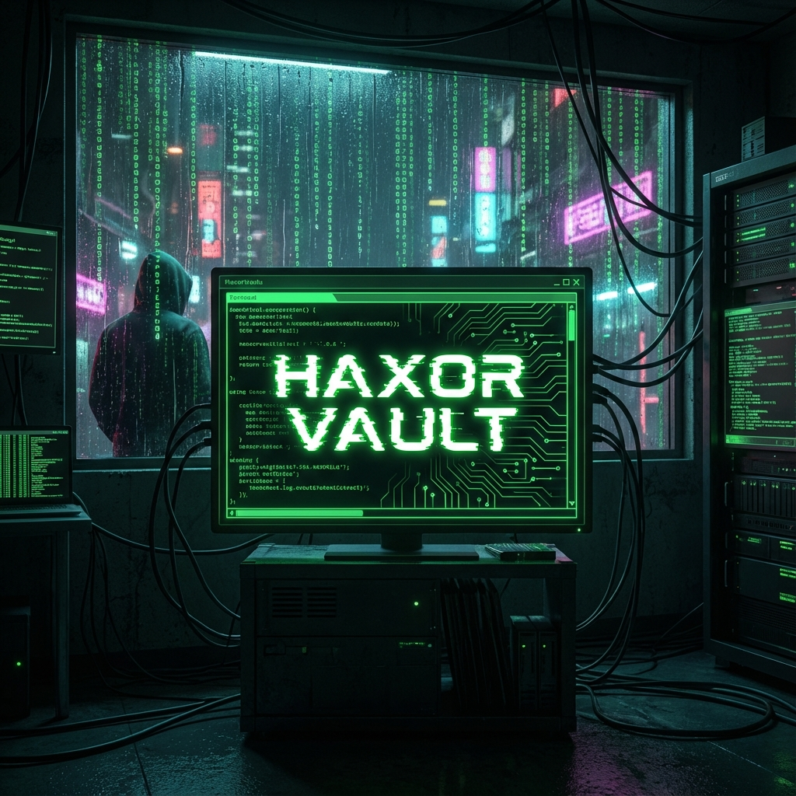

# 🔐 Hacking Vault



**Hacking Vault** is a gamified cybersecurity training platform designed to track HackTheBox machines, monitor progress, and provide an immersive "hacker" experience.

## 🌟 Features

*   **Machine Tracking**: Browse and search active and retired machines.
*   **Progress Monitoring**: Track your owns (User/Root) and points.
*   **Immersive UI**:
    *   **Neural Particles**: Dynamic, radioactive background effects.
    *   **Glitch System**: Difficulty-scaled visual distortions.
    *   **Cyberpunk Aesthetic**: Neon styling and terminal-inspired typography.
*   **Integration**: Syncs directly with HackTheBox API.

## 📚 Documentation

We have comprehensive documentation available in the `docs/` directory:

*   [**🏠 Documentation Home**](docs/INDEX.md)
*   [🚀 Getting Started](docs/GETTING_STARTED.md)
*   [🏗️ Architecture](docs/ARCHITECTURE.md)
*   [🎨 Styling & Effects](docs/STYLING_AND_EFFECTS.md)
*   [🧩 Components](docs/COMPONENTS.md)
*   [📝 Changelog](docs/CHANGELOG.md)

## 🚀 Quick Start

```bash
# Clone the repo
git clone <repo-url>

# Install dependencies
npm install

# Run dev server
npm run dev
```

See [Getting Started](docs/GETTING_STARTED.md) for full setup instructions.

## 🤝 Contributing

Contributions are welcome! See [CONTRIBUTING.md](docs/CONTRIBUTING.md) for guidelines.

---

*Built with React, Vite, Tailwind CSS, and Supabase.*
